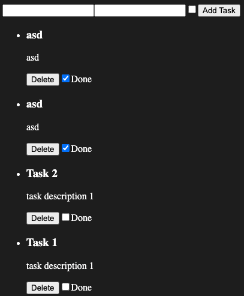

# RKT Query CRUD (redux toolkit query)

## Ejemplo básico de un crud sin estilos para practicar con redux toolkit query:




## Para probar en Desarrollo

```
git clone https://github.com/JuanIgnacioBogado/rtk-query-crud
pnpm install
pnpm back   // levantar json-server
pnpm dev    // levantar el front
```